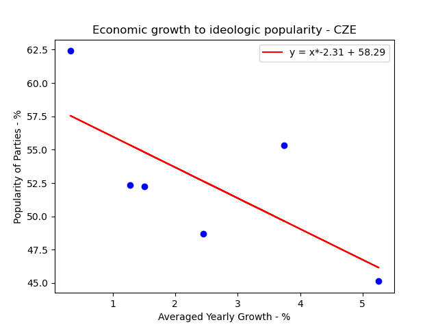
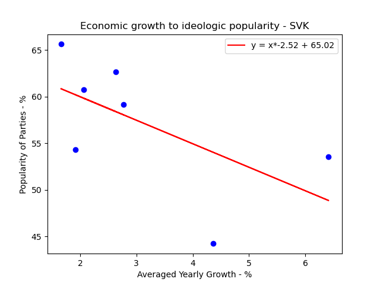
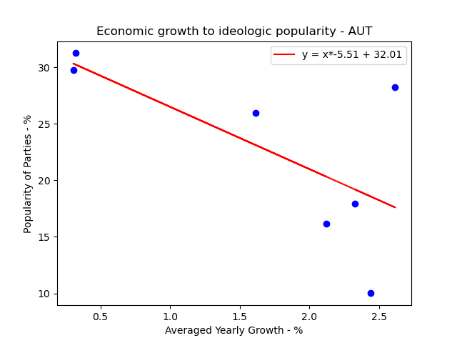

Introduction
---
When looking at different countries and their political situation, there often comes a question to mind about how that country got their current government. This analysis tries to look at possible correlation between economic hardship and its influence on popularity of different ideologies. Mainly, this analysis looks at ideologies like populism and communism in central Europe. What we are specifically looking at is yearly GDP growth sum and party popularity, which is judged by percentage earned in parliamentary (only in chambers of deputies) elections.

Parties and their ideological sympathies are judged by wikipedia and assigned to each party by me, where for simplicity I looked mainly for populist/nationalistic/communist tendencies of each party and assigned one ideology best describing that party. This analysis takes into account all parties, which succeeded in getting at least 1.5% for one respective election. Also, party names in my data are abbreviated, but can be found by that abbreviation in wikipedia for cross-checking. in data, I tried my best to take into account each party's ideological evolution, as parties splinter, progress and change their voter base.

As for GDP growth, I looked at yearly growth rates of a country from year 1998+, which was then taken and made into an arithmetic mean to represent the economic situation between 2 election years, where new election year is still attributed to the previous government (Therefore, if elections were held in 2002 and 2006, governing parties were attributed the economic situation in years 2003-2006).

Data Collection
---
Data about parties popularity in each election were hand collected from Wikipedia, because Wikidata ended up unfit for the region of central Europe. Data about parties is also better hand-picked because of the small scale of this project and the volutility of parties in the early 2000s. Data is stored separately for each country, each election year and is in .csv format, where one can find party name abbreviation, main ideology and percentage aquired in that given election. 
This data is collected for further analysis by a python script, which looks for all countries in ``Countries/`` directory, then for each election year to process the data. Parties are then segregated into a group belonging to targeted ideologies, which are taken from ``data/ideologies.csv`` file.

```py
def getElections(country : Path, focused_ideologies : set) -> dict[int, float]:
    focused_performance = {}
    elections = country.glob('elections/*')
    for election in elections:
        election_name = int(election.name.split('/')[-1])
        percentage = 0
        with open(election.joinpath('elections.csv')) as election_file:
            # NOTE: gets rid of a header
            election_file.readline()
            line = election_file.readline()
            while line != "":
                line = line.strip().split(',')
                ideology = line[1]

                if ideology in focused_ideologies:
                    percentage += float(line[2])

                line = election_file.readline()

        focused_performance[election_name] = percentage

    return focused_performance
```
Data about the Economy of countries is collected from [Worldbank](www.worldbank.org). Data is stored locally in ``data/GDP.csv`` file, from where it is further processed by the same python script. Worldbank used .csv format more leniently, therefore the script had to account for more shenanigans with `"` symbols.

```py
def getMeanGDP(project_directory : Path, election_years : list, country_tag) -> dict[int, float]:
    COMMENT_HEIGHT = 4
    BASE_GAP = 4
    GDP_path = project_directory.joinpath('data/GDP.csv')
    with open(GDP_path) as GDP_file:
        for i in range(COMMENT_HEIGHT):
            GDP_file.readline()

        header = GDP_file.readline().replace("\"", "").strip().split(',')

        line = GDP_file.readline().strip().split("\",\"")
        while line != "":
            current_tag = line[1]
            if current_tag == country_tag:
                break
            line = GDP_file.readline().strip().split("\",\"")

        line[0] = line[0].replace("\"", "")
        line[-1] = line[-1].replace("\"", "")

        interval_GDP = {}
        last_election_year = election_years[0] - BASE_GAP
        year_index = 0

        # NOTE Problem with index acquisition, so we manually check indexes
        for field in header:
            if str(last_election_year) == field.replace("\"", ""):
                break
            year_index += 1

        for year in election_years:
            GDP_yearly_growth_sum = 0
            governance_years = year - last_election_year
            for i in range(governance_years):
                year_index += 1
                GDP_growth = float(line[year_index].replace("\"", ""))
                GDP_yearly_growth_sum += GDP_growth

            meanGDP = GDP_yearly_growth_sum / governance_years
            interval_GDP[year] = meanGDP
            last_election_year = year

        return interval_GDP
```

Data analysis
---
To ascertain, whether there is a correlation between yearly GDP growth and the popularity of populist/nationalist/communist parties, I used linear regression. Thus we can set out null hypothesis to slope being zero and an alternate hypothesis saying there is a link between these two phenomena. To do this linear regression, I used python library ``scipy``. 

```py
def findCorrelation(ideological_performance : dict[int, float], economic_performance : dict[int, float]):
    economy = []
    performances = []
    for year in economic_performance:
        economy.append(economic_performance[year])
        performances.append(ideological_performance[year])

    slope, intercept, r_value, p_value, std_err = stats.linregress(economy, performances)

    print("Slope:", slope)
    print("R squared:", r_value ** 2)
    print("P-value:", p_value)
```

Czech Republic
---
We get a linear function of ``ideological_performance = -2.31 * GDP_growth + 58.29``. **49,96%** of the variance in ideological popularity can be attributed to the yearly GDP growth (R^2 value). P value being ``0.116``.\


Slovak Republic
---
We get a linear function of ``ideological_performance = -2.52 * GDP_growth + 65.02``. **36,2%** of the variance in ideological popularity can be attributed to the yearly GDP growth (R^2 value). P value being ``0.153``.\


Austria
---
We get a linear function of ``ideological_performance = -5.51 * GDP_growth + 32.01``. **44,99%** of the variance in ideological popularity can be attributed to the yearly GDP growth (R^2 value). P value being ``0.099``.\


Conclusion
---
We can clearly see that there is a relationship between a higher averaged yearly growth rate and a smaller percentage of votes for parties with populist/nationalist/communist ideologies. Therefore confirming our alternate hypothesis. 

(More on p values in Discussion)

Discussion
---

We observed higher than desired p values for each country we analysed. Whis value can be attributed to a small sample rate, for which I decided because of the chaotic situation in Czech and Slovak republic in the 90'. The reason why I decided not to account for these p values is because we can observe this phenomenon in 3 different countries with very different economic and political situations.

Another point of contention may be my categorisation of political parties, where I:
1. (SR) Judged SMER as populist from their creation
2. (CZ) Assigned CSSD left-wing populism ideology
3. (CZ) Judged ANO as technocratic populist in 2013 elections
4. Generally assigned right-wing populism ideology when the parties were also nationalist (nationalist ideology was also in the focus group)
5. Some small paries were harder to ideologically pinpoint because of their short lifespan.


